<a href="#"></a>


# Medical Appointments Backend 

This is the backend service for the [Medical Appointments](https://medical-appointments.pl) application. 
<br>You can see frontend GitHub Repository [here](https://github.com/konradcz2001/medical-appointments-frontend).


## Table of Contents

- [Project Description](#page_facing_up-project-description)
- [Features](#sparkles-features)
- [Technologies Used](#hammer_and_wrench-technologies-used-leftwards_arrow_with_hook)
- [API Documentation](#books-api-documentation-leftwards_arrow_with_hook)
- [Hosting](#globe_with_meridians-hosting-leftwards_arrow_with_hook)
- [Sample Login Data](#closed_lock_with_key-sample-login-data-leftwards_arrow_with_hook)
- [Visual Examples](#movie_camera-visual-examples-leftwards_arrow_with_hook)
- [Class Diagrams](#bar_chart-class-diagrams-leftwards_arrow_with_hook)
- [Setup Instructions](#gear-setup-instructions-leftwards_arrow_with_hook)
- [Contributing](#handshake-contributing-leftwards_arrow_with_hook)

[//]: # "- [License](#scroll-license-leftwards_arrow_with_hook)"


## :page_facing_up: Project Description

The Medical Appointments Backend is a Spring Boot application. It provides APIs for managing medical appointments. It includes functionalities for user authentication, doctor scheduling, client management, and more.
It provides APIs for managing . 

The backend is designed to support seamless integration with a frontend application, ensuring a smooth and efficient user experience. Additionally, it includes features such as data validation, error handling, and security measures to protect sensitive information.


## :sparkles: Features

- User authentication and authorization using JWT.
- CRUD operations for doctors, clients, appointments, and related data.
- Scheduling and managing doctor appointments.
- Integration with Swagger for API documentation.
- Flyway migrations populates the database with generated sample data for presentation purposes.


## :hammer_and_wrench: Technologies Used [:leftwards_arrow_with_hook:](#table-of-contents)

- Java
- Spring Boot
- Spring Security
- JPA/Hibernate
- Swagger/OpenAPI
- Flyway


## :books: API Documentation [:leftwards_arrow_with_hook:](#table-of-contents)

The API documentation is available via Swagger. You can access it [here](https://api.medical-appointments.pl/swagger-ui/index.html).
<br><br>For some operations you must log in and provide a token. You can log in with [Sample Login Data](#closed_lock_with_key-sample-login-data-leftwards_arrow_with_hook).

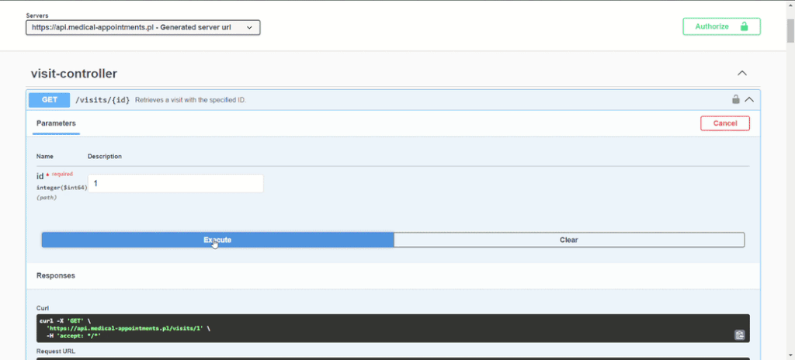

Swagger cannot distinguish endpoints with the same path and http method, so some GET endpoints are combined into one with all parameters required. For more details, see the code.


## :globe_with_meridians: Hosting [:leftwards_arrow_with_hook:](#table-of-contents)
You can access the application via the links:
##### The entire application with frontend:<br> https://medical-appointments.pl
##### Swagger documentation for backend:<br> https://api.medical-appointments.pl/swagger-ui/index.html


## :closed_lock_with_key: Sample Login Data [:leftwards_arrow_with_hook:](#table-of-contents)

Here are some sample login credentials that you can use to test the application:

- **Doctor User**
   - Email: `doctor@doctor`
   - Password: `Doctor!123`
<br><br>
- **Client User**
   - Email: `client@client`
   - Password: `Client!123`
     <br><br>

- **Admin User**
   - Email: `admin@admin`
   - Password: `admin`


## :movie_camera: Visual Examples [:leftwards_arrow_with_hook:](#table-of-contents)

- [Doctor searching](#doctor-searching)
- [Booking an appointment](#booking-an-appointment-leftwards_arrow_with_hook)
- [Updating profile data](#updating-profile-data-leftwards_arrow_with_hook)
- [Doctor's schedule update](#doctors-schedule-update-leftwards_arrow_with_hook)
- [Doctor's type of visit update](#doctors-type-of-visit-update-leftwards_arrow_with_hook)
- [Doctor's leave update](#doctors-leave-update-leftwards_arrow_with_hook)
- [Doctor's specialization update and visit cancellation](#doctors-specialization-update-and-visit-cancellation-leftwards_arrow_with_hook)
- [Sending an inquiry](#sending-an-inquiry-leftwards_arrow_with_hook)
- [In mailbox](#in-mailbox-leftwards_arrow_with_hook)

### Doctor searching
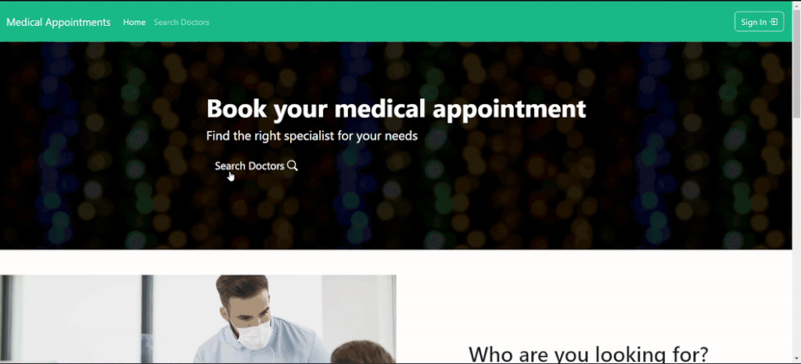

### Booking an appointment [:leftwards_arrow_with_hook:](#movie_camera-visual-examples-leftwards_arrow_with_hook)
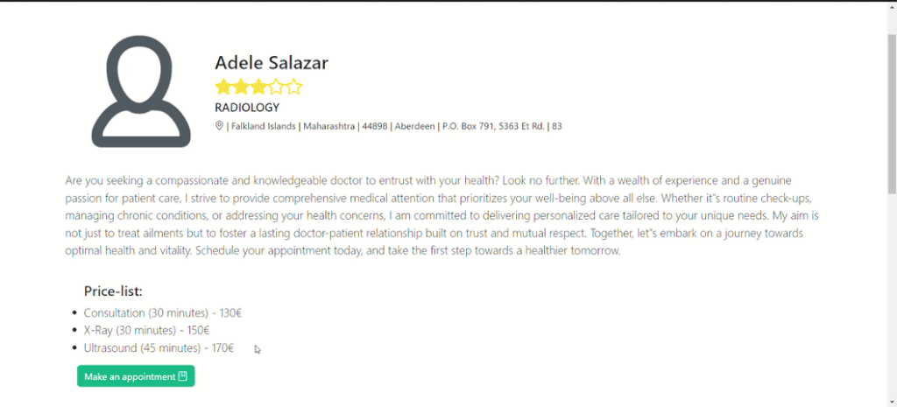

### Updating profile data [:leftwards_arrow_with_hook:](#movie_camera-visual-examples-leftwards_arrow_with_hook)
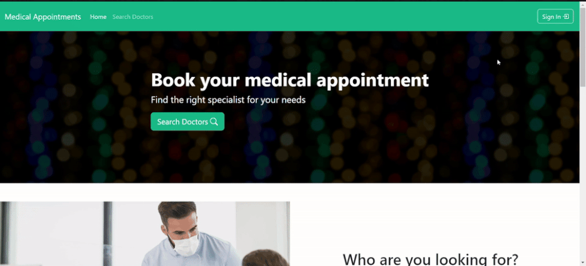

### Doctor's schedule update [:leftwards_arrow_with_hook:](#movie_camera-visual-examples-leftwards_arrow_with_hook)
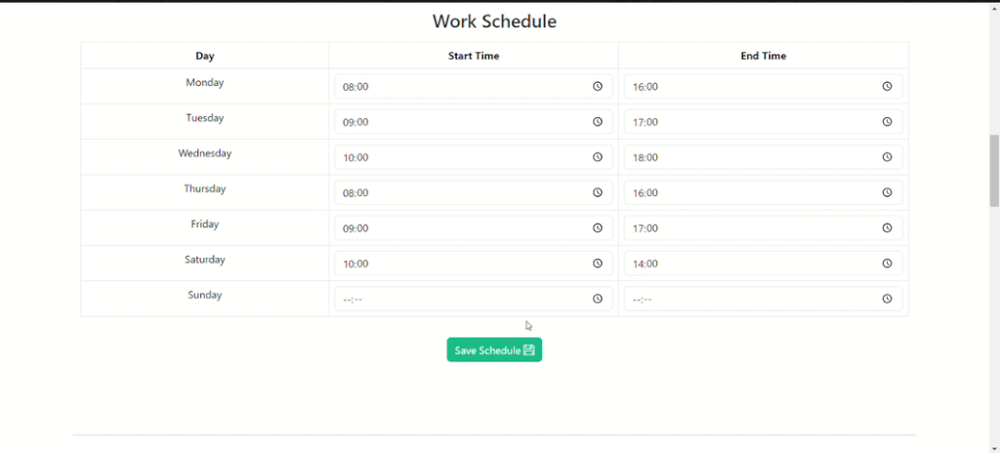

### Doctor's type of visit update [:leftwards_arrow_with_hook:](#movie_camera-visual-examples-leftwards_arrow_with_hook)
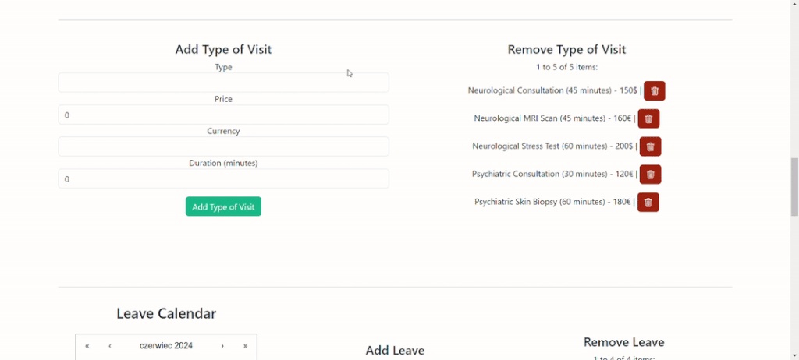

### Doctor's leave update [:leftwards_arrow_with_hook:](#movie_camera-visual-examples-leftwards_arrow_with_hook)
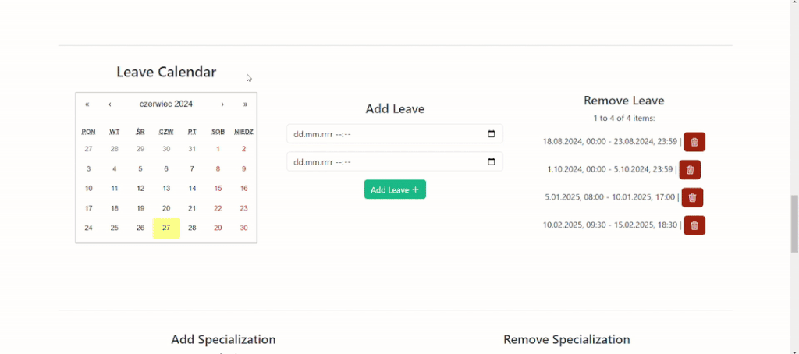

### Doctor's specialization update and visit cancellation [:leftwards_arrow_with_hook:](#movie_camera-visual-examples-leftwards_arrow_with_hook)
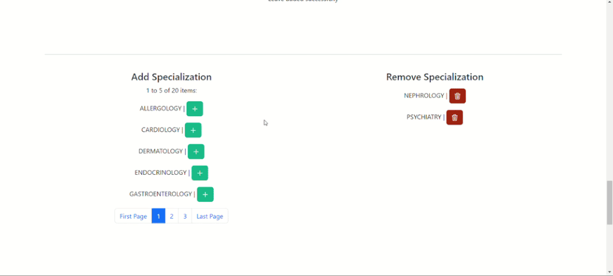

### Sending an inquiry [:leftwards_arrow_with_hook:](#movie_camera-visual-examples-leftwards_arrow_with_hook)
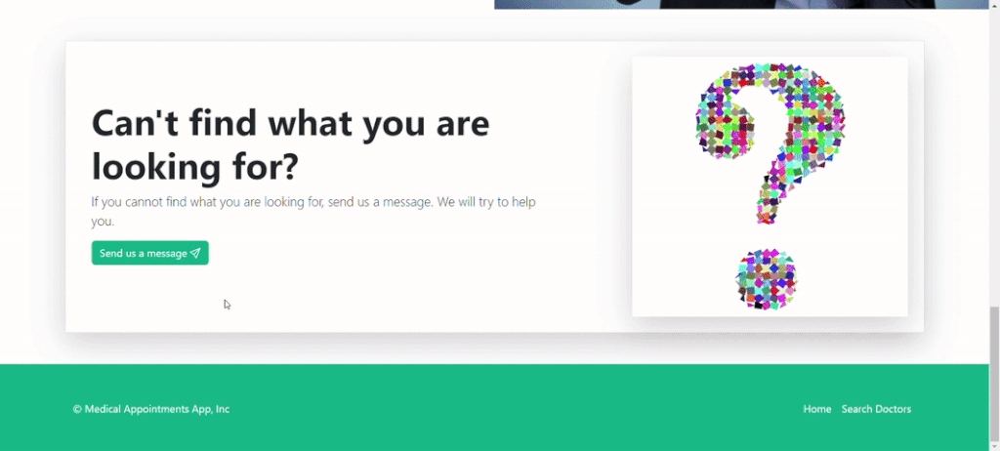

### In mailbox [:leftwards_arrow_with_hook:](#movie_camera-visual-examples-leftwards_arrow_with_hook)
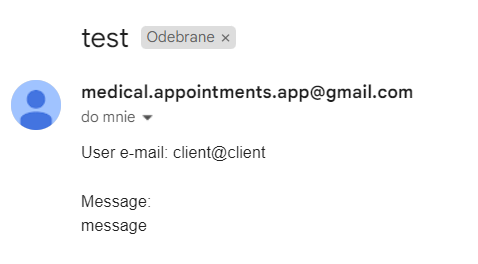


## :bar_chart: Class Diagrams [:leftwards_arrow_with_hook:](#table-of-contents)
Open the image in a new tab to see details.

- [Client Package](#client-package)
- [Common Package](#common-package-leftwards_arrow_with_hook)
- [Contact Package](#contact-package-leftwards_arrow_with_hook)
- [Doctor Package](#doctor-package-leftwards_arrow_with_hook)
- [Exception Package](#exception-package-leftwards_arrow_with_hook)
- [Leave Package](#leave-package-leftwards_arrow_with_hook)
- [Review Package](#review-package-leftwards_arrow_with_hook)
- [Security Package](#security-package-leftwards_arrow_with_hook)
- [Specialization Package](#specialization-package-leftwards_arrow_with_hook)
- [Visit Package](#visit-package-leftwards_arrow_with_hook)

### [Client Package](src/main/java/com/github/konradcz2001/medicalappointments/client)
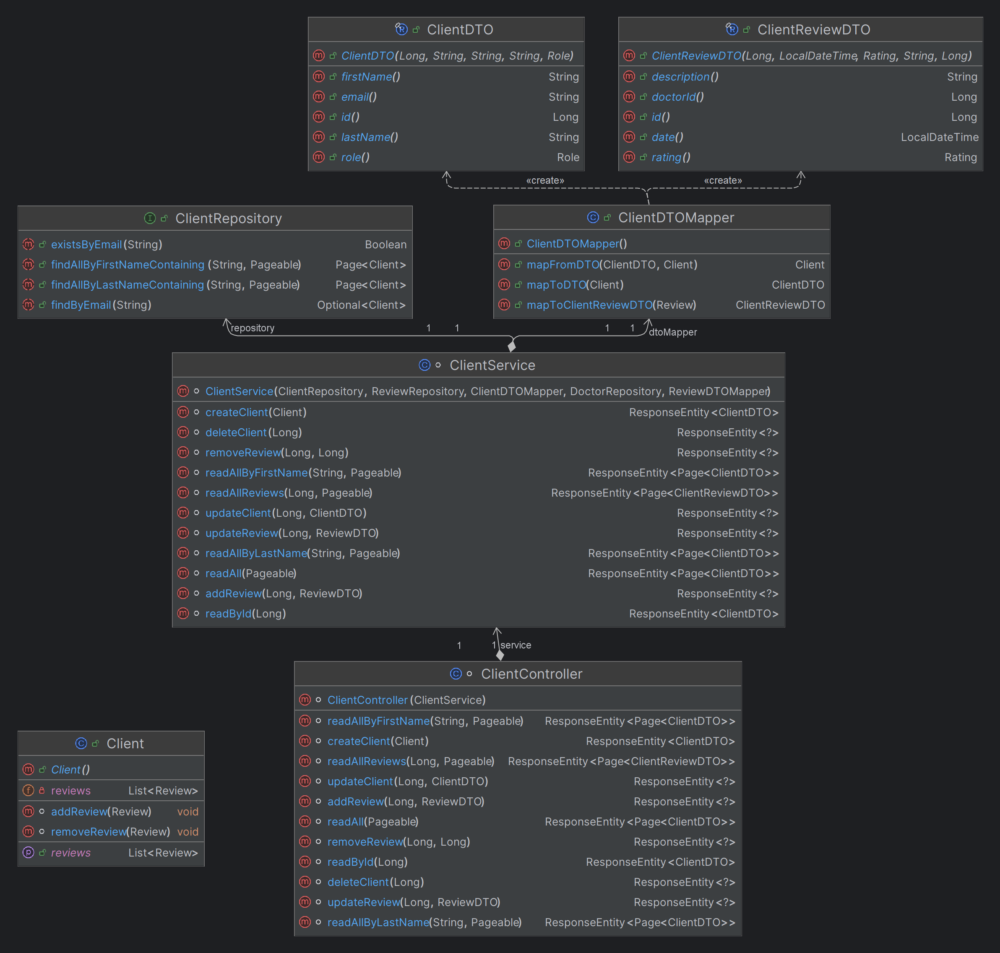

### [Common Package](src/main/java/com/github/konradcz2001/medicalappointments/common) [:leftwards_arrow_with_hook:](#bar_chart-class-diagrams-leftwards_arrow_with_hook)
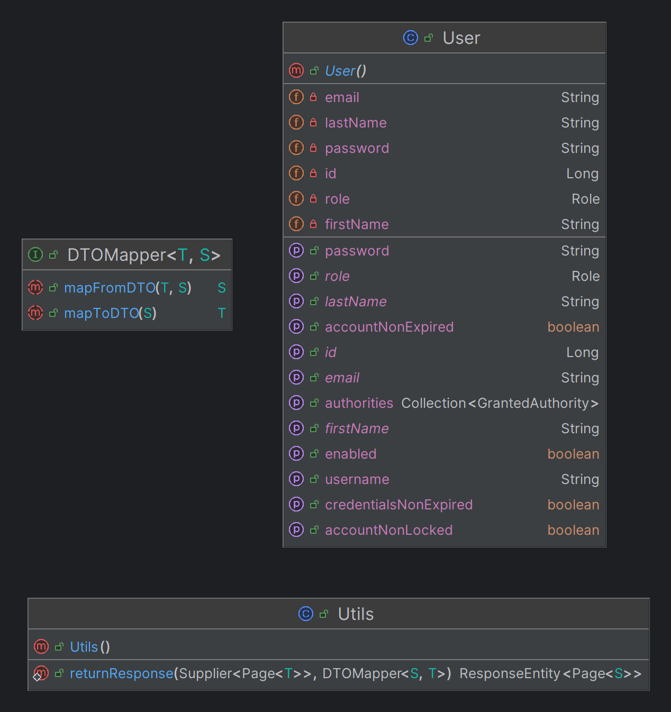

### [Contact Package](src/main/java/com/github/konradcz2001/medicalappointments/contact) [:leftwards_arrow_with_hook:](#bar_chart-class-diagrams-leftwards_arrow_with_hook)


### [Doctor Package](src/main/java/com/github/konradcz2001/medicalappointments/doctor) [:leftwards_arrow_with_hook:](#bar_chart-class-diagrams-leftwards_arrow_with_hook)
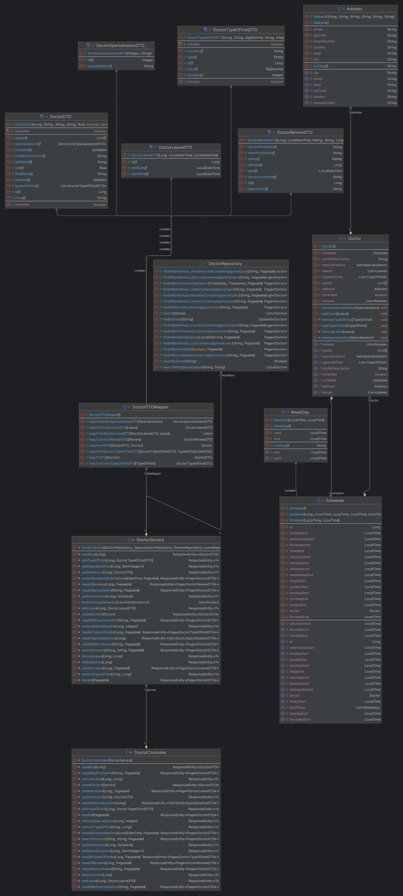

### [Exception Package](src/main/java/com/github/konradcz2001/medicalappointments/exception) [:leftwards_arrow_with_hook:](#bar_chart-class-diagrams-leftwards_arrow_with_hook)
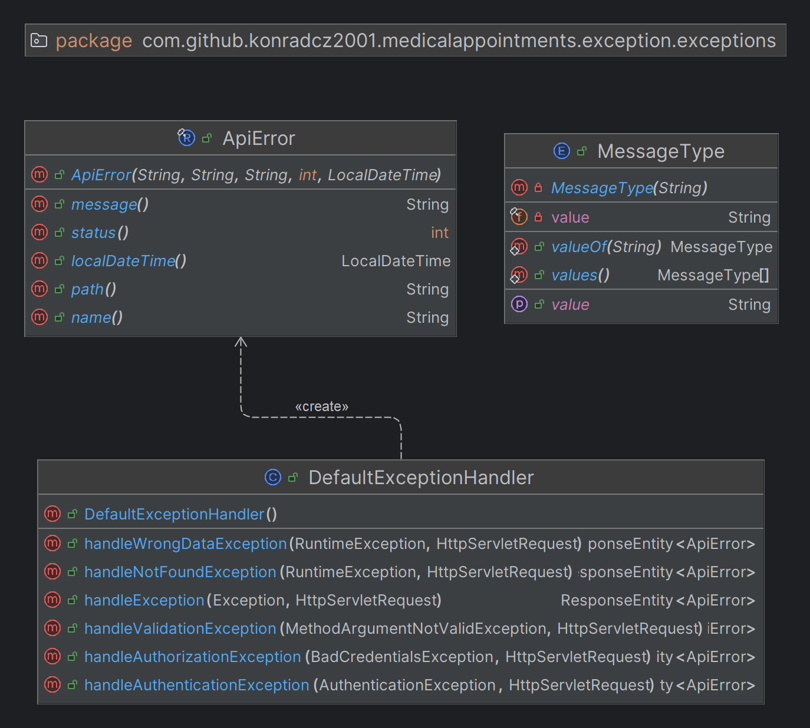

### [Leave Package](src/main/java/com/github/konradcz2001/medicalappointments/leave) [:leftwards_arrow_with_hook:](#bar_chart-class-diagrams-leftwards_arrow_with_hook)
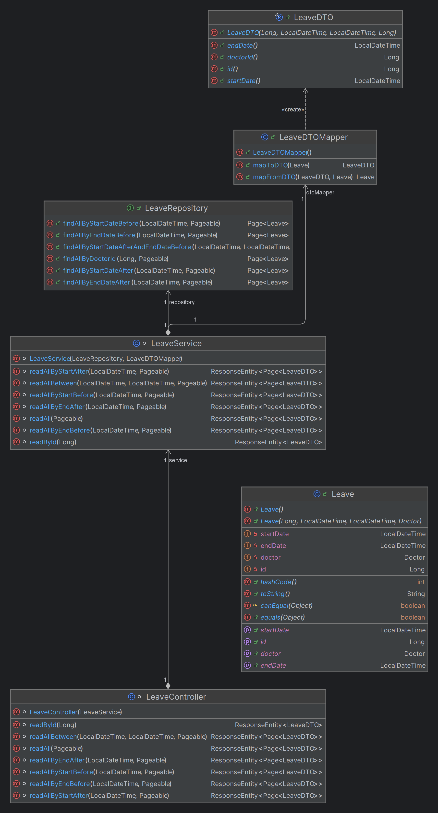

### [Review Package](src/main/java/com/github/konradcz2001/medicalappointments/review) [:leftwards_arrow_with_hook:](#bar_chart-class-diagrams-leftwards_arrow_with_hook)
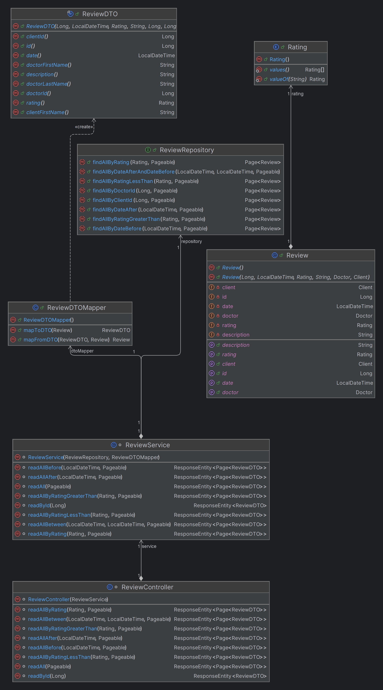

### [Security Package](src/main/java/com/github/konradcz2001/medicalappointments/security) [:leftwards_arrow_with_hook:](#bar_chart-class-diagrams-leftwards_arrow_with_hook)
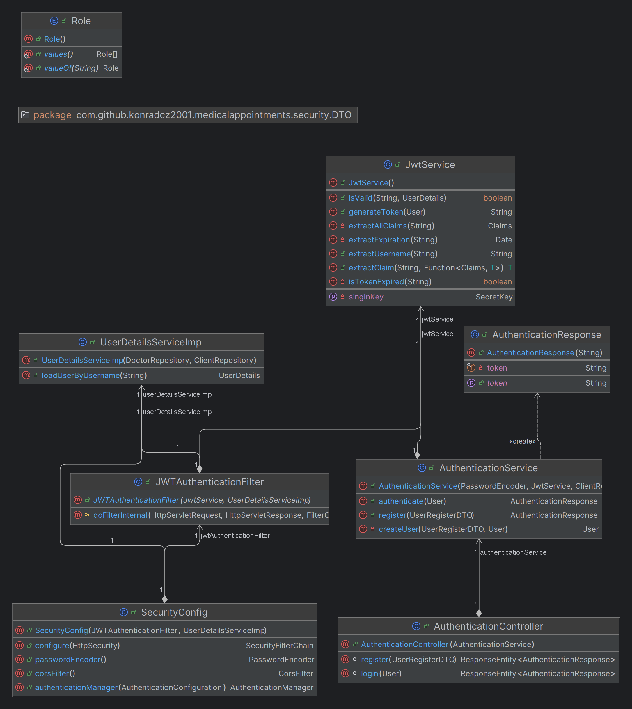

### [Specialization Package](src/main/java/com/github/konradcz2001/medicalappointments/specialization) [:leftwards_arrow_with_hook:](#bar_chart-class-diagrams-leftwards_arrow_with_hook)
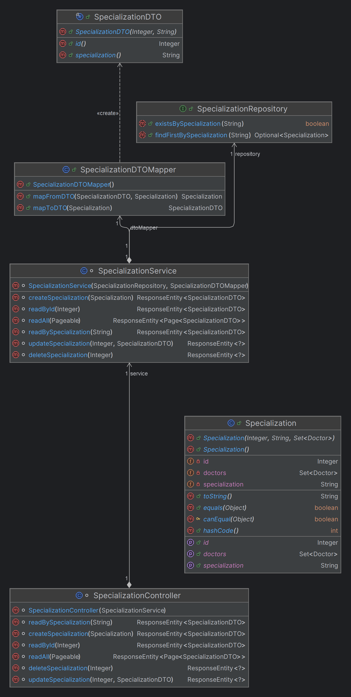

### [Visit Package](src/main/java/com/github/konradcz2001/medicalappointments/visit) [:leftwards_arrow_with_hook:](#bar_chart-class-diagrams-leftwards_arrow_with_hook)
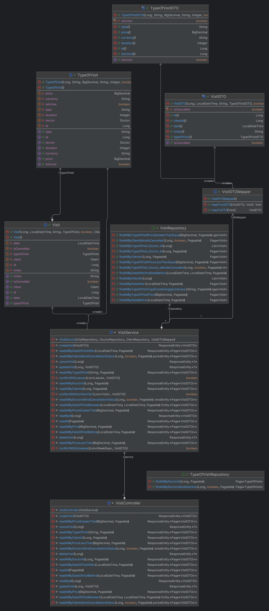


## :gear: Setup Instructions [:leftwards_arrow_with_hook:](#table-of-contents)

#### Prerequisites

- Java 17 or higher
- Maven
- PostgreSQL

#### Installation

1. Clone the repository:
    ```bash
    git clone https://github.com/konradcz2001/medical-appointments-backend.git
    cd medical-appointments-backend
    ```

2. Add to the `application.properties` file your configuration:<br><br>
    - Database configuration:
      - spring.datasource.url
      - spring.datasource.username
      - spring.datasource.password<br><br>
      
    - Email configuration:
       - spring.mail.password (16-character password generated by Gmail, providing access to the sending email)
       - spring.mail.to.username (target email address to which user questions are to be sent)<br><br>
   
    - Cross Origin configuration:
       - cross.origin.site.url<br><br>

   - JWT configuration:
      - app.jwt.secret.key<br><br>
     
   - Remove `spring.profiles.active`<br><br>

3. Build the project:
    ```bash
    mvn clean install
    ```

4. Run the application:
    ```bash
    mvn spring-boot:run
    ```

#### Usage

Once the application is running, you can access the APIs at `http://localhost:8080`.

#### Testing

To run the tests, use the following command:
```bash
mvn test
```
See all tests [here](src/test/java/com/github/konradcz2001/medicalappointments).


## :handshake: Contributing [:leftwards_arrow_with_hook:](#table-of-contents)
Contributions are welcome! Please fork the repository and create a pull request with your changes. You can also contact me: konradcz2001@gmail.com


[//]: # "
## :scroll: License [:leftwards_arrow_with_hook:](#table-of-contents)
This project is licensed under the [MIT License](LICENSE).
"


<br><br>