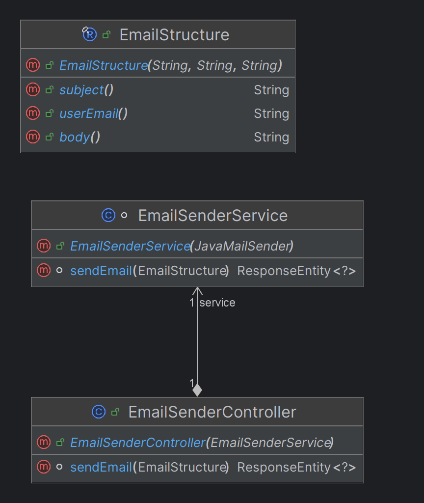

# Medical Appointments Backend

This is the backend service for the [Medical Appointments](https://medical-appointments.pl) application. It provides APIs for managing medical appointments, doctors, clients, and other related entities.
You can see frontend GitHub Repository [here](https://github.com/konradcz2001/medical-appointments-frontend).

## Table of Contents

- [Project Description](#project-description)
- [Features](#features)
- [Technologies Used](#technologies-used)
- [API Documentation](#api-documentation)
- [Hosting](#hosting)
- [Sample Login Data](#sample-login-data)
- [Visual Examples](#visual-examples)
- [Class Diagrams](#class-diagrams)
- [Setup Instructions](#setup-instructions)
- [Contributing](#contributing)
- [License](#license)

## Project Description

The Medical Appointments Backend is a Spring Boot application that serves as the backend for managing medical appointments. It includes functionalities for user authentication, doctor scheduling, client management, and more.

## Features

- User authentication and authorization using JWT.
- CRUD operations for doctors, clients, appointments, and related data.
- Scheduling and managing doctor appointments.
- Integration with Swagger for API documentation.
- Flyway migrations populates the database with generated sample data for presentation purposes.

## Technologies Used

- Java
- Spring Boot
- Spring Security
- JPA/Hibernate
- Swagger/OpenAPI
- Flyway

## API Documentation

The API documentation is available via Swagger. You can access it [here](https://api.medical-appointments.pl/swagger-ui/index.html).
<br><br>For some operations you must log in and provide a token. You can log in with [Sample Login Data](#sample-login-data).


Swagger cannot distinguish endpoints with the same path and http method, so some GET endpoints are combined into one with all parameters required. For more details, see the code.

## Hosting
You can access the application via the links:
##### The entire application with frontend:<br> https://medical-appointments.pl
##### Swagger documentation for backend:<br> https://api.medical-appointments.pl/swagger-ui/index.html

## Sample Login Data

Here are some sample login credentials that you can use to test the application:

- **Doctor User**
   - Email: `doctor@doctor`
   - Password: `Doctor!123`
<br><br>
- **Client User**
   - Email: `client@client`
   - Password: `Client!123`
     <br><br>

- **Admin User**
   - Email: `admin@admin`
   - Password: `admin`

## Visual Examples
#### Doctor searching:

#### Booking an appointment:

#### Updating profile data:

#### Doctor's schedule update:

#### Doctor's type of visit update:

#### Doctor's leave update:

#### Doctor's specialization update and visit cancellation:

#### Sending a inquiry:

#### In mailbox:


## Class Diagrams

#### Client Package:

#### Common Package:

#### Contact Package:

#### Doctor Package:

#### Exception Package:

#### Leave Package:

#### Review Package:

#### Security Package:

#### Specialization Package:

#### Visit Package:


## Setup Instructions

#### Prerequisites

- Java 17 or higher
- Maven
- PostgreSQL

#### Installation

1. Clone the repository:
    ```bash
    git clone https://github.com/konradcz2001/medical-appointments-backend.git
    cd medical-appointments-backend
    ```

2. Add to the `application.properties` file your configuration:<br><br>
    - Database configuration:
      - spring.datasource.url
      - spring.datasource.username
      - spring.datasource.password<br><br>
      
    - Email configuration:
       - spring.mail.password (16-character password generated by Gmail, providing access to the sending email)
       - spring.mail.to.username (target email address to which user questions are to be sent)<br><br>
   
    - Cross Origin configuration:
       - cross.origin.site.url<br><br>

   - JWT configuration:
      - app.jwt.secret.key<br><br>
     
   - Remove `spring.profiles.active`<br><br>

3. Build the project:
    ```bash
    mvn clean install
    ```

4. Run the application:
    ```bash
    mvn spring-boot:run
    ```

#### Usage

Once the application is running, you can access the APIs at `http://localhost:8080`.

#### Testing

To run the tests, use the following command:
```bash
mvn test
```

## Contributing
Contributions are welcome! Please fork the repository and create a pull request with your changes. You can also contact me: konradcz2001@gmail.com

## License
This project is licensed under the [MIT License](LICENSE).<br><br>


